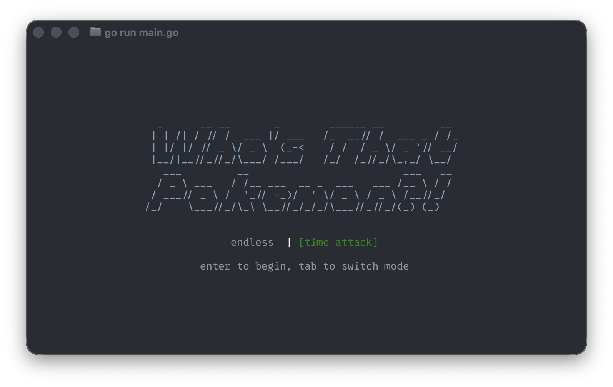
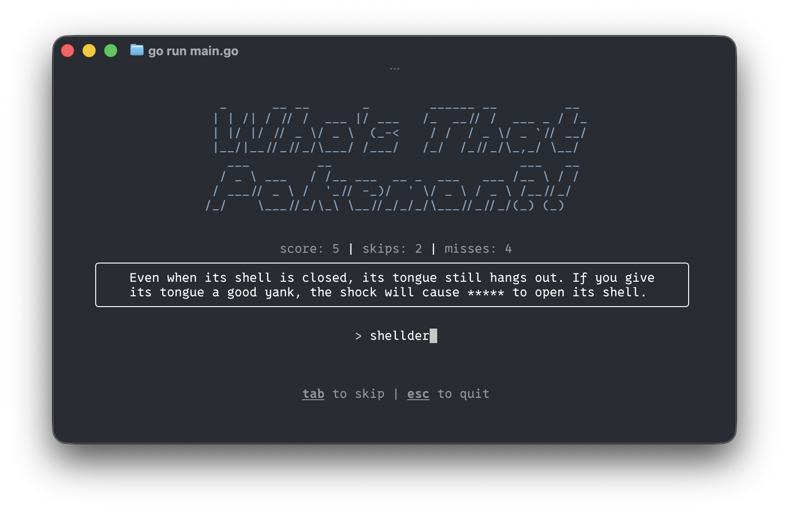
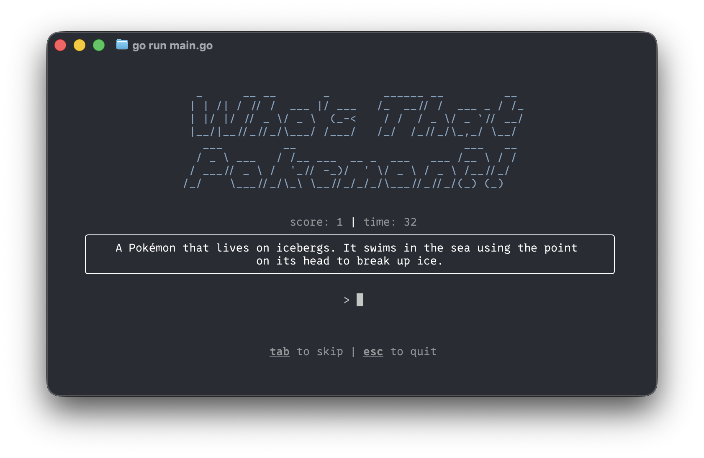
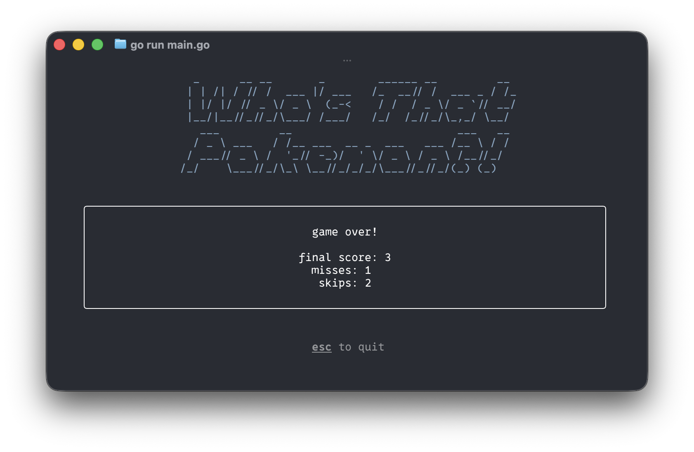

# Who's that pokemon?!

A TUI game made to explore golang, bubbletea and lipgloss.

## Install

#### install with go

assuming you already have go installed and go's bin added to your PATH
```sh
go install github.com/BradPatras/wtp-go@latest
```

#### executable downloads

The [Releases](https://github.com/BradPatras/wtp-go/releases) page contains download links for macOS, Windows and Linux

----



## Two game-types

#### endless mode

Try to guess all 151, however long it takes...



#### time attack

Guess as many as you can in 60 seconds. Skips carry a 5 second penalty.




(I have yet to break out of single digit scores...)
